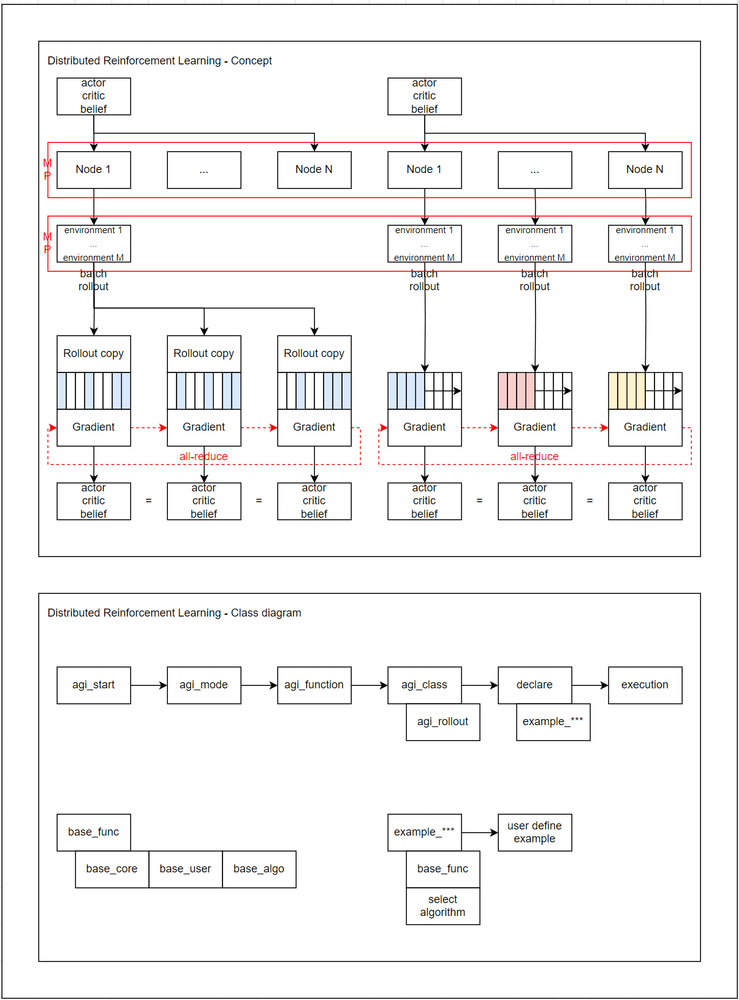
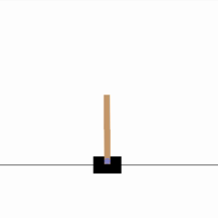
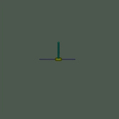
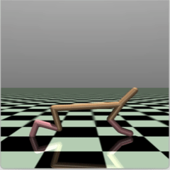
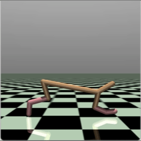

### Distributed Reinforcement Learning

Distributed Reinforcement Learning is a scalable reinforcement learning framework designed to accelerate data collection and policy optimization.

Multiple rollout workers interact with independent environment instances in parallel, while collected trajectories are aggregated and used to update the policy or value networks.

This approach improves sample efficiency, increases training throughput, and enables reinforcement learning agents to learn from diverse experiences at scale.

### AIML

Adaptive Importance Metric Learning (AIML) is a trajectory-conditioned re-weighting module for reinforcement learning.

AIML learns dimension-wise importance weights from recent history and applies them to the current normalized input representation.

The input can be an observation, state, action-related feature, or any structured representation used by the policy or value or belief network.

## concept

  
   
  <em>Concept overview</em>

## cart pole ( Gymnasium )

<table>
  <tr>
    <td align="center">
      
       
      <em> Initial training ( position 0 ~ 2 )</em>
    </td>
    <td align="center">
      
       
      <em> post training ( position ≈ 0 ) </em>
    </td>
  </tr>
</table>

## inverted double pendulum ( Gymnasium, MuJoCo )

<table>
  <tr>
    <td align="center">
      
       
      <em> Initial training ( position 0 ~ 2 )</em>
    </td>
    <td align="center">
      
       
      <em> post training ( position ≈ 0 ) </em>
    </td>
  </tr>
</table>

## half cheetah ( Gymnasium, MuJoCo )

<table>
  <tr>
    <td align="center">
      
       
      <em> Initial training ( 0 m/s )</em>
    </td>
    <td align="center">
      
       
      <em> post training ( 6 ~ 7 m/s ) </em>
    </td>
  </tr>
</table>

 
